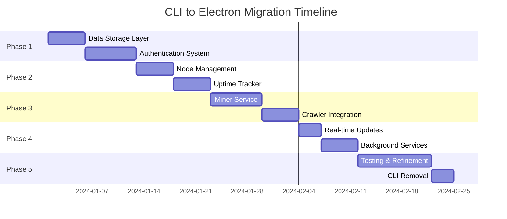

# Complete CLI to Electron Migration Documentation

## Executive Summary

This document provides a comprehensive migration plan for moving ALL functionality from the node-cli Python wrapper to direct implementation within the Electron desktop application. This migration will eliminate the Python intermediary layer, improve performance, simplify deployment, and provide better integration with the desktop environment.

> **Status:** The bundled CLI has been removed from the desktop app; the information below remains for historical context and architectural reference.

## Table of Contents

1. [Current Architecture Overview](#current-architecture-overview)
2. [Migration Strategy](#migration-strategy)
3. [Component Migration Plans](#component-migration-plans)
4. [Implementation Roadmap](#implementation-roadmap)
5. [Risk Analysis & Mitigation](#risk-analysis--mitigation)

## Current Architecture Overview

### System Architecture
```
┌─────────────────────────────────────────────┐
│          Electron Desktop App               │
│                                             │
│  ┌──────────┐  IPC   ┌─────────────────┐  │
│  │ Renderer ├────────►│     Main        │  │
│  │ Process  │         │    Process      │  │
│  └──────────┘         └────────┬────────┘  │
│                               │             │
└───────────────────────────────┼─────────────┘
                                │ Spawn
                                ▼
┌───────────────────────────────────────────┐
│            Python CLI Process              │
│                                            │
│  ┌─────────────────────────────────────┐  │
│  │         FastAPI Server               │  │
│  │  ┌─────────┐  ┌─────────────────┐  │  │
│  │  │  Auth   │  │   Node Manager   │  │  │
│  │  │ Service │  │                  │  │  │
│  │  └─────────┘  └─────────────────┘  │  │
│  │                                      │  │
│  │  ┌─────────┐  ┌─────────────────┐  │  │
│  │  │  Miner  │  │    Uptime        │  │  │
│  │  │ Service │  │    Tracker       │  │  │
│  │  └────┬────┘  └─────────────────┘  │  │
│  │       │                              │  │
│  │       ▼                              │  │
│  │  ┌─────────────────────────────┐   │  │
│  │  │   Crawler Service           │   │  │
│  │  │  (Docker: crawl4ai)         │   │  │
│  │  └─────────────────────────────┘   │  │
│  └─────────────────────────────────────┘  │
│                                            │
│  ┌─────────────────────────────────────┐  │
│  │     Encrypted Data Storage          │  │
│  │   (~/.opi_node_data/)              │  │
│  └─────────────────────────────────────┘  │
│                                            │
└───────────────────────────────────────────┘
                    │
                    ▼
        External Services:
        - OptimAI API
        - Miner API
        - Docker Daemon
```

### Target Architecture
```
┌──────────────────────────────────────────────┐
│           Electron Desktop App                │
│                                               │
│  ┌──────────┐        ┌──────────────────┐   │
│  │ Renderer │  IPC   │    Main Process   │   │
│  │ Process  ├────────►                   │   │
│  └──────────┘        │  ┌─────────────┐ │   │
│                      │  │Auth Service │ │   │
│                      │  └─────────────┘ │   │
│                      │                   │   │
│                      │  ┌─────────────┐ │   │
│                      │  │Node Manager │ │   │
│                      │  └─────────────┘ │   │
│                      │                   │   │
│                      │  ┌─────────────┐ │   │
│                      │  │Miner Service│ │   │
│                      │  └─────────────┘ │   │
│                      │                   │   │
│                      │  ┌─────────────┐ │   │
│                      │  │   Uptime    │ │   │
│                      │  │   Tracker   │ │   │
│                      │  └─────────────┘ │   │
│                      │                   │   │
│                      │  ┌─────────────┐ │   │
│                      │  │  Crawler    │ │   │
│                      │  │  Service    │ │   │
│                      │  └─────────────┘ │   │
│                      │                   │   │
│                      │  ┌─────────────┐ │   │
│                      │  │ Encrypted   │ │   │
│                      │  │   Store     │ │   │
│                      │  └─────────────┘ │   │
│                      └──────────────────┘   │
│                                               │
└───────────────────────────────────────────────┘
                        │
                        ▼
            External Services:
            - OptimAI API (Direct)
            - Miner API (Direct)
            - Docker Daemon (Direct)
            - Crawl4AI Container (Direct)
```

## Migration Strategy

### Core Principles

1. **Incremental Migration**: Migrate component by component while maintaining compatibility
2. **Feature Parity**: Ensure all CLI functionality is preserved or improved
3. **Zero Downtime**: Support gradual transition without breaking existing users
4. **Performance First**: Optimize for desktop environment advantages
5. **Security Enhancement**: Leverage Electron's security model

### Migration Phases



## Component Migration Plans

### 1. Data Storage Layer

#### Current Implementation (Python)
```python
# node_cli/store/base.py
class StoreBase:
    - Singleton pattern with thread safety
    - Fernet encryption for all data
    - JSON file storage in ~/.opi_node_data/
    - Automatic key generation and management
```

#### Target Implementation (TypeScript/Electron)
```typescript
// src/main/services/storage/encrypted-store.ts
interface EncryptedStore {
  // Core functionality
  get<T>(key: string): Promise<T>
  set<T>(key: string, value: T): Promise<void>
  delete(key: string): Promise<void>
  clear(): Promise<void>

  // Encryption
  encrypt(data: any): string
  decrypt(encrypted: string): any
}

class SecureStorage implements EncryptedStore {
  private cipher: Cipher
  private storePath: string

  constructor() {
    // Use Electron's app.getPath('userData')
    this.storePath = path.join(app.getPath('userData'), 'secure-data')
    this.cipher = new AESCipher(this.getDerivedKey())
  }

  private getDerivedKey(): Buffer {
    // Use Electron safeStorage API for key management
    return safeStorage.decryptString(
      fs.readFileSync(this.keyPath)
    )
  }
}
```

**Migration Steps:**
1. Implement encryption using Node.js crypto module
2. Use Electron's safeStorage API for key management
3. Migrate data location from ~/.opi_node_data/ to Electron userData
4. Create migration utility for existing data
5. Implement same singleton pattern for consistency

### 2. Authentication System

#### Current Implementation (Python)
```python
# PKCE OAuth2 Flow
1. Generate code_verifier and code_challenge
2. Login with email/password
3. Exchange authorization code for tokens
4. Store tokens encrypted
5. Automatic token refresh
6. Logout with cleanup
```

#### Target Implementation (TypeScript/Electron)
```typescript
// src/main/services/auth/auth-service.ts
class AuthenticationService {
  private tokenManager: TokenManager
  private pkceGenerator: PKCEGenerator

  async login(email: string, password: string): Promise<AuthTokens> {
    // 1. Generate PKCE challenge
    const { verifier, challenge } = this.pkceGenerator.generate()

    // 2. Login request
    const { authorization_code } = await apiClient.post('/auth/signin', {
      email,
      password,
      code_challenge: challenge,
      code_challenge_method: 'S256'
    })

    // 3. Token exchange
    const tokens = await apiClient.post('/auth/token', {
      grant_type: 'authorization_code',
      code: authorization_code,
      code_verifier: verifier
    })

    // 4. Secure storage
    await this.tokenManager.storeTokens(tokens)

    return tokens
  }

  async refreshToken(): Promise<string> {
    const refreshToken = await this.tokenManager.getRefreshToken()
    const { access_token } = await apiClient.post('/auth/refresh', {
      refresh_token: refreshToken
    })
    await this.tokenManager.updateAccessToken(access_token)
    return access_token
  }
}
```

**Migration Steps:**
1. Implement PKCE generator using crypto.randomBytes
2. Create token manager with secure storage
3. Add auth interceptors to axios clients
4. Implement auto-refresh logic
5. Add IPC handlers for renderer access

### 3. Node Management

#### Current Implementation (Python)
```python
# Node lifecycle management
- Start node with authentication check
- Stop node with graceful shutdown
- Restart functionality
- Status monitoring
- Lock file management
```

#### Target Implementation (TypeScript/Electron)
```typescript
// src/main/services/node/node-manager.ts
class NodeManager {
  private status: NodeStatus = 'stopped'
  private services: Map<string, BaseService>
  private lockFile: LockFile

  async start(): Promise<void> {
    // Check prerequisites
    await this.checkAuthentication()
    await this.checkDocker()

    // Acquire lock
    await this.lockFile.acquire()

    // Start services
    await this.startService('uptime-tracker')
    await this.startService('miner')

    this.status = 'running'
    this.emit('status-changed', this.status)
  }

  async stop(): Promise<void> {
    // Graceful shutdown
    for (const [name, service] of this.services) {
      await service.stop()
    }

    await this.lockFile.release()
    this.status = 'stopped'
  }

  getStatus(): NodeStatus {
    return {
      status: this.status,
      services: this.getServicesStatus(),
      uptime: this.getUptime()
    }
  }
}
```

**Migration Steps:**
1. Create service registry pattern
2. Implement lock file using proper-lockfile
3. Add graceful shutdown handlers
4. Create status monitoring
5. Add system tray integration

### 4. Uptime Tracker

#### Current Implementation (Python)
```python
# Cycle-based uptime tracking
- 10-second increment cycles
- Automatic reward claiming
- Cycle completion callbacks
- Encoded data transmission
- Persistence across restarts
```

#### Target Implementation (TypeScript/Electron)
```typescript
// src/main/services/uptime/uptime-tracker.ts
class UptimeTracker extends EventEmitter {
  private currentCycle: UptimeCycle
  private cycleTimer: NodeJS.Timer
  private store: UptimeStore

  async start(): Promise<void> {
    // Load or create cycle
    this.currentCycle = await this.store.getCurrentCycle()
      || await this.createNewCycle()

    // Start increment timer
    this.cycleTimer = setInterval(() => {
      this.incrementCycle()
    }, 10000) // 10 seconds

    // Start reward claim checker
    this.startRewardChecker()
  }

  private async incrementCycle(): Promise<void> {
    this.currentCycle.seconds_elapsed += 10

    // Check cycle completion (60 seconds)
    if (this.currentCycle.seconds_elapsed >= 60) {
      await this.completeCycle()
    }

    // Persist state
    await this.store.updateCycle(this.currentCycle)

    // Emit progress
    this.emit('progress', {
      cycle: this.currentCycle,
      percentage: (this.currentCycle.seconds_elapsed / 60) * 100
    })
  }

  private async completeCycle(): Promise<void> {
    // Encode and submit
    const encoded = this.encoder.encode(this.currentCycle)
    await uptimeClient.submitCycle(encoded)

    // Create new cycle
    this.currentCycle = await this.createNewCycle()

    // Emit completion
    this.emit('cycle-completed')
  }

  private async checkAndClaimRewards(): Promise<void> {
    const unclaimedRewards = await uptimeClient.getUnclaimedRewards()

    for (const reward of unclaimedRewards) {
      const claimed = await uptimeClient.claimReward(reward.id)
      if (claimed) {
        this.emit('reward-claimed', reward)
      }
    }
  }
}
```

**Migration Steps:**
1. Implement cycle management with timers
2. Create encoder for data transmission
3. Add persistence with encrypted store
4. Implement reward claiming logic
5. Add WebSocket notifications

### 5. Miner Service

#### Current Implementation (Python)
```python
# Mining with SSE and crawling
- SSE listener for real-time assignments
- Heartbeat maintenance (30s)
- Fallback polling
- Platform filtering (Google only)
- Docker-based crawling
- Assignment submission
```

#### Target Implementation (TypeScript/Electron)
```typescript
// src/main/services/miner/miner-service.ts
class MinerService extends EventEmitter {
  private sseClient: EventSource
  private crawler: CrawlerService
  private heartbeatTimer: NodeJS.Timer
  private activeAssignments: Set<string>

  async start(): Promise<void> {
    // Initialize crawler
    await this.crawler.initialize()

    // Start SSE connection
    await this.connectSSE()

    // Start heartbeat
    this.startHeartbeat()

    // Fallback polling
    this.startPolling()
  }

  private async connectSSE(): Promise<void> {
    const token = await this.authService.getAccessToken()

    this.sseClient = new EventSource(
      `${MINER_BASE_URL}/mining/sse/assignments`,
      {
        headers: {
          'Authorization': `Bearer ${token}`
        }
      }
    )

    this.sseClient.onmessage = (event) => {
      const assignment = JSON.parse(event.data)
      this.handleAssignment(assignment)
    }

    this.sseClient.onerror = () => {
      // Reconnect logic
      setTimeout(() => this.connectSSE(), 5000)
    }
  }

  private async handleAssignment(assignment: MiningAssignment): Promise<void> {
    // Filter platforms
    if (assignment.platform !== 'google') {
      return
    }

    // Check if already processing
    if (this.activeAssignments.has(assignment.id)) {
      return
    }

    this.activeAssignments.add(assignment.id)

    try {
      // Start assignment
      await minerClient.post(`/mining/assignments/${assignment.id}/start`)

      // Crawl content
      const result = await this.crawler.crawl(assignment.url, {
        sessionId: `mining-${assignment.id}`,
        lightMode: true
      })

      // Submit results
      await minerClient.post(`/mining/assignments/${assignment.id}/submit`, {
        content: result.markdown,
        metadata: result.metadata
      })

      this.emit('assignment-completed', assignment.id)

    } catch (error) {
      this.emit('assignment-failed', assignment.id, error)
    } finally {
      this.activeAssignments.delete(assignment.id)
    }
  }

  private startHeartbeat(): void {
    this.heartbeatTimer = setInterval(async () => {
      try {
        await minerClient.post('/mining/heartbeat')
      } catch (error) {
        this.emit('heartbeat-failed', error)
      }
    }, 30000) // 30 seconds
  }
}
```

**Migration Steps:**
1. Implement EventSource for SSE
2. Create assignment queue management
3. Integrate with crawler service
4. Add heartbeat system
5. Implement platform filtering
6. Add retry and error handling

### 6. Crawler Service

> See [CRAWLER_MIGRATION.md](./CRAWLER_MIGRATION.md) for detailed crawler migration plan

**Key Points:**
- Direct Docker container management
- HTTP API communication with crawl4ai
- Session management for performance
- Multiple crawling modes

### 7. Real-time Updates

#### Current Implementation (Python)
```python
# WebSocket and SSE
- WebSocket server for UI updates
- SSE client for miner assignments
- Broadcast service for events
```

#### Target Implementation (TypeScript/Electron)
```typescript
// src/main/services/realtime/realtime-manager.ts
class RealtimeManager {
  private wsClients: Set<WebSocket>
  private sseClients: Map<string, EventSource>

  // Internal communication (Main <-> Renderer)
  setupIPC(): void {
    ipcMain.on('subscribe', (event, channel) => {
      this.subscriptions.set(channel, event.sender)
    })
  }

  // External communication (Backend services)
  connectToBackend(): void {
    // WebSocket for general updates
    this.ws = new WebSocket(`${WS_URL}/ws`)
    this.ws.on('message', (data) => {
      this.broadcast('backend-update', JSON.parse(data))
    })

    // SSE for specific streams
    this.connectSSE('mining', `${MINER_URL}/mining/sse/assignments`)
  }

  broadcast(channel: string, data: any): void {
    // Send to renderer processes
    for (const webContents of this.subscriptions.get(channel)) {
      webContents.send(channel, data)
    }
  }
}
```

**Migration Steps:**
1. Implement WebSocket client
2. Create SSE client manager
3. Setup IPC event system
4. Add reconnection logic
5. Implement event filtering

### 8. Background Services

#### Service Orchestration
```typescript
// src/main/services/service-orchestrator.ts
class ServiceOrchestrator {
  private services: Map<string, IService> = new Map()
  private startupOrder = [
    'storage',
    'auth',
    'docker',
    'crawler',
    'uptime',
    'miner',
    'realtime'
  ]

  async initialize(): Promise<void> {
    // Register all services
    this.registerServices()

    // Start in dependency order
    for (const name of this.startupOrder) {
      await this.startService(name)
    }
  }

  async shutdown(): Promise<void> {
    // Stop in reverse order
    for (const name of [...this.startupOrder].reverse()) {
      await this.stopService(name)
    }
  }
}
```

### 9. API Clients

#### HTTP Client Configuration
```typescript
// src/main/api/clients/
export const clients = {
  auth: createAuthClient(API_URL),
  miner: createMinerClient(MINER_URL),
  uptime: createUptimeClient(API_URL),
  device: createDeviceClient(API_URL)
}

function createAuthClient(baseURL: string) {
  const client = axios.create({ baseURL })

  // Add request interceptor for auth
  client.interceptors.request.use(async (config) => {
    if (!config.skipAuth) {
      const token = await tokenManager.getAccessToken()
      config.headers.Authorization = `Bearer ${token}`
    }
    return config
  })

  // Add response interceptor for token refresh
  client.interceptors.response.use(
    response => response,
    async (error) => {
      if (error.response?.status === 401) {
        await authService.refreshToken()
        return client(error.config)
      }
      throw error
    }
  )

  return client
}
```

### 10. System Utilities

#### Docker Management
```typescript
// src/main/utils/docker.ts
export class DockerManager {
  async isAvailable(): Promise<boolean> {
    try {
      await exec('docker --version')
      return true
    } catch {
      return false
    }
  }

  async isContainerRunning(name: string): Promise<boolean> {
    const { stdout } = await exec(
      `docker ps --filter name=${name} --format "{{.Names}}"`
    )
    return stdout.trim() === name
  }

  async startContainer(config: ContainerConfig): Promise<void> {
    const args = [
      'run', '-d',
      '--name', config.name,
      '-p', `${config.port}:${config.port}`,
      '--shm-size=1g',
      config.image
    ]

    await exec(`docker ${args.join(' ')}`)
  }
}
```

#### Device Information
```typescript
// src/main/utils/device-info.ts
export class DeviceInfo {
  static async getSystemInfo(): Promise<SystemInfo> {
    return {
      os: process.platform,
      arch: process.arch,
      cpus: os.cpus().length,
      memory: os.totalmem(),
      hostname: os.hostname(),
      version: app.getVersion(),
      nodeVersion: process.version
    }
  }

  static async generateDeviceId(): Promise<string> {
    const machineId = await getMachineId()
    return crypto
      .createHash('sha256')
      .update(machineId)
      .digest('hex')
  }
}
```

## Implementation Roadmap

### Week 1-2: Foundation
- [ ] Setup project structure
- [ ] Implement encrypted storage
- [ ] Create authentication service
- [ ] Setup API clients

### Week 3-4: Core Services
- [ ] Implement node manager
- [ ] Create uptime tracker
- [ ] Setup IPC communication
- [ ] Add token management

### Week 5-6: Mining & Crawling
- [ ] Implement miner service
- [ ] Create crawler service
- [ ] Setup Docker management
- [ ] Add SSE support

### Week 7-8: Real-time & Polish
- [ ] Implement WebSocket client
- [ ] Create service orchestrator
- [ ] Add system tray integration
- [ ] Implement auto-updater

### Week 9-10: Testing & Migration
- [ ] Unit test coverage
- [ ] Integration testing
- [ ] Data migration tools
- [ ] Performance optimization

### Week 11-12: Deployment
- [ ] Beta testing
- [ ] Documentation
- [ ] CLI deprecation plan
- [ ] Production release

## Risk Analysis & Mitigation

### Technical Risks

| Risk | Impact | Probability | Mitigation |
|------|--------|-------------|------------|
| Docker availability | High | Medium | Provide installation guide, detect and prompt |
| Data migration failures | High | Low | Create backup/restore tools, validation |
| SSE connection issues | Medium | Medium | Implement fallback polling |
| Token refresh race conditions | Medium | Low | Use mutex locks, queue requests |
| Platform-specific issues | Medium | Medium | Test on Windows/Mac/Linux |

### Migration Risks

| Risk | Impact | Mitigation |
|------|--------|------------|
| User disruption | High | Gradual rollout, feature flags |
| Data loss | High | Automated backups, migration validation |
| Feature gaps | Medium | Comprehensive testing, beta program |
| Performance regression | Medium | Benchmarking, optimization |

## Testing Strategy

### Unit Testing
```typescript
// Example test structure
describe('AuthenticationService', () => {
  it('should perform PKCE login flow', async () => {
    const service = new AuthenticationService()
    const tokens = await service.login('test@example.com', 'password')

    expect(tokens).toHaveProperty('access_token')
    expect(tokens).toHaveProperty('refresh_token')
  })

  it('should refresh expired tokens', async () => {
    // Test token refresh logic
  })
})
```

### Integration Testing
- End-to-end authentication flow
- Mining assignment processing
- Uptime cycle completion
- Docker container management
- Data persistence and encryption

### Performance Testing
- Memory usage monitoring
- CPU utilization
- Network request optimization
- Startup time measurement
- Background service impact

## Security Considerations

### Data Protection
1. **Encryption at Rest**: All sensitive data encrypted using AES-256
2. **Key Management**: Use Electron safeStorage API
3. **Token Security**: Never expose tokens to renderer process
4. **IPC Security**: Validate all IPC messages

### Network Security
1. **HTTPS Only**: Enforce TLS for all API calls
2. **Certificate Pinning**: Optional for high security
3. **Request Signing**: HMAC for sensitive operations
4. **Rate Limiting**: Prevent abuse

### Process Security
1. **Context Isolation**: Enable in all renderer processes
2. **Node Integration**: Disable in renderers
3. **CSP Headers**: Strict content security policy
4. **Sandbox**: Enable Chromium sandbox

## Monitoring & Logging

### Logging Strategy
```typescript
// src/main/utils/logger.ts
import winston from 'winston'

export const logger = winston.createLogger({
  level: process.env.LOG_LEVEL || 'info',
  format: winston.format.json(),
  transports: [
    new winston.transports.File({
      filename: 'error.log',
      level: 'error'
    }),
    new winston.transports.File({
      filename: 'combined.log'
    })
  ]
})

// Usage
logger.info('Node started', { timestamp: Date.now() })
logger.error('Authentication failed', { error: err.message })
```

### Metrics Collection
- Service uptime
- API response times
- Error rates
- Resource usage
- User engagement

## Documentation Requirements

### User Documentation
1. **Migration Guide**: Step-by-step for existing users
2. **Installation Guide**: Docker setup, prerequisites
3. **Troubleshooting**: Common issues and solutions
4. **FAQ**: Frequently asked questions

### Developer Documentation
1. **Architecture Overview**: System design and patterns
2. **API Reference**: IPC and HTTP endpoints
3. **Service Interfaces**: Public APIs for each service
4. **Contributing Guide**: Development setup and guidelines

## Success Criteria

### Functional Requirements
- [ ] All CLI features implemented
- [ ] Data migration successful
- [ ] Performance improved or maintained
- [ ] Security enhanced
- [ ] Cross-platform compatibility

### Non-Functional Requirements
- [ ] <5 second startup time
- [ ] <200MB memory usage idle
- [ ] <5% CPU usage idle
- [ ] 99.9% service availability
- [ ] Zero data loss during migration

## Rollback Strategy

### Phases
1. **Feature Flags**: Toggle between CLI and native
2. **Dual Mode**: Run both implementations
3. **Data Sync**: Keep stores synchronized
4. **Gradual Cutover**: Migrate users in batches
5. **Emergency Rollback**: Restore CLI if issues

### Rollback Procedure
```bash
# 1. Stop native services
electron.services.stopAll()

# 2. Re-enable CLI
electron.settings.set('use-cli', true)

# 3. Start CLI process
electron.cli.start()

# 4. Sync data
electron.migration.syncFromNativeToCliStore()

# 5. Notify user
electron.notify('Reverted to CLI mode')
```

## Appendix

### A. File Structure
```
src/
├── main/
│   ├── services/
│   │   ├── auth/
│   │   ├── miner/
│   │   ├── crawler/
│   │   ├── uptime/
│   │   ├── node/
│   │   ├── storage/
│   │   └── realtime/
│   ├── api/
│   │   └── clients/
│   ├── utils/
│   │   ├── docker.ts
│   │   ├── device-info.ts
│   │   ├── logger.ts
│   │   └── encoder.ts
│   └── ipc/
│       └── handlers/
├── renderer/
│   └── src/
│       └── services/
└── preload/
    └── index.ts
```

### B. Environment Variables
```env
# API Configuration
API_URL=https://api.optimai.network
MINER_URL=https://api-onchain-staging.optimai.network
WS_URL=wss://ws.optimai.network

# Docker Configuration
DOCKER_CRAWLER_IMAGE=unclecode/crawl4ai:0.7.4
DOCKER_CRAWLER_PORT=11235

# Service Configuration
UPTIME_CYCLE_DURATION=60
MINER_HEARTBEAT_INTERVAL=30000
SSE_RECONNECT_DELAY=5000

# Security
ENCRYPTION_ALGORITHM=aes-256-gcm
TOKEN_REFRESH_THRESHOLD=300

# Logging
LOG_LEVEL=info
LOG_MAX_SIZE=10485760
LOG_MAX_FILES=5
```

### C. Dependencies
```json
{
  "dependencies": {
    "axios": "^1.6.0",
    "winston": "^3.11.0",
    "node-machine-id": "^1.1.12",
    "proper-lockfile": "^4.1.2",
    "eventsource": "^2.0.2",
    "ws": "^8.14.0"
  },
  "devDependencies": {
    "@types/node": "^20.0.0",
    "@types/eventsource": "^1.1.11",
    "@types/ws": "^8.5.5",
    "jest": "^29.0.0"
  }
}
```

---

*Document Version: 1.0*
*Last Updated: [Current Date]*
*Status: Planning Phase*
*Total Estimated Timeline: 12 weeks*
*Estimated Team Size: 2-3 developers*
